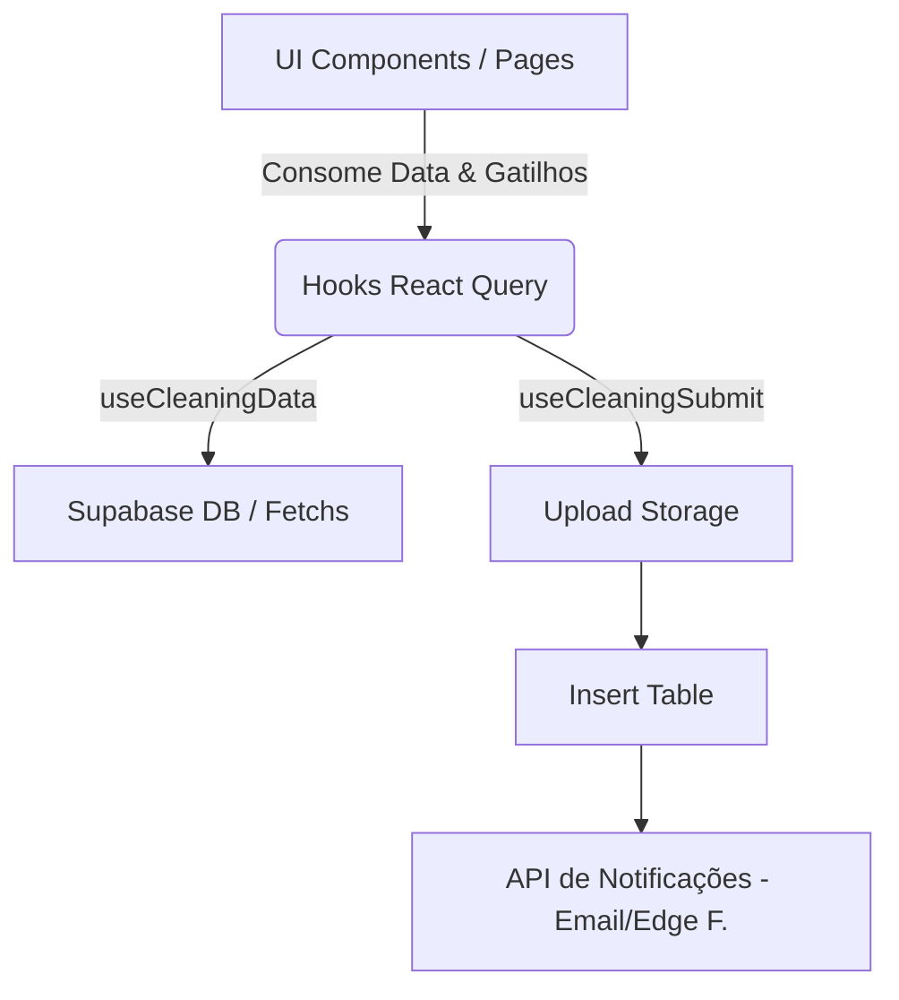
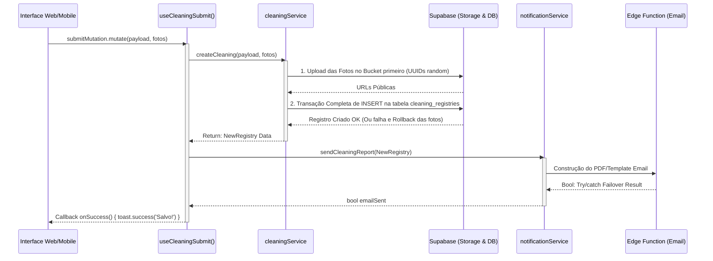

# Módulo: Limpeza e Organização

Este documento serve como a **memória do módulo** (criado segundo as diretrizes do *Documenter* do Antigravity) para detalhar os fluxos de arquitetura e lógica envolvidos neste recurso.

## 🎯 Objetivo de Negócio
Garantir e registrar o cumprimento da rotina semanal de limpeza das Fazendas nos setores de **Almoxarifado** e **Posto de Abastecimento**.

As regras ditam que:
- **Almoxarifado** deve ser limpo e registrado toda Segunda-feira.
- **Posto de Combustível** deve ser limpo e registrado toda Sexta-feira.

## 🏗 Arquitetura (Separation of Concerns)

O módulo segue puramente um modelo de arquitetura modular orientada a **React Query**:

### 1. View Layer (Presentation)
- **`src/pages/CleaningList.tsx`**: Painel Administrativo ou de Fazenda. O Controller isola quem vê o que dependendo do contexto da Rule Baseado no Cargo RLS (Multitenancy). Admin visualiza a grande `AdminStatusTable.tsx`, gerente visualiza `StatusCard.tsx` apenas de sua filial.
- **`src/pages/mobile/MobileCleaning.tsx`**: A versão PWA foca estritamente no motor Tap & Go — botões gigantes, upload nativo pela câmera, ausência absoluta de data tables.
- **`react-hot-toast` Layer**: Adicionado globalmente via `App.tsx` para interceptar callbacks de sucesso e erro e providenciar uma experiência de usuário rica e não-bloqueante no frontend (substituindo chamadas síncronas de `alert()`).

### 2. State & Mutation Layer (React Query Hooks)
Todos localizados em `src/hooks/`:
- **`useCleaningSubmit`**: O maestro deste módulo. Quando um usuário bate "GRAVAR", este hook assume o controle de toda a transação com Resiliência Condicional (um erro no e-mail não derruba o fluxo do banco de dados).
- **`useCleaningData`**: Gerencia a prop de caching do `useQuery`, validando o tempo e cache hit de todas as chamadas pesadas das relatorias. Caching Invalida e Auto-Recarrega automaticamente nas alterações (Deletion / Insertion).

### 3. Service Layer (Data Fetching / Contratos de API)
- **`src/services/cleaningService.ts`**: Mantém o contrato puro com as APIs de persistência (DB SQL Supabase). Nenhuma UI tem permissão de encostar neste Service layer.

## 🔄 Fluxo de Negócio - O Atom Submit

Abaixo está a mecânica vital arquitetada no `useCleaningSubmit.ts`. Este diagrama desmistifica o upload e disparo de emails atômicos.

## 🔒 Regras de RLS (Isolamento Multitenancy)
- Os administradores não têm filtro atrelado na fetch `cleaningsQueryFilters`. Logo o sistema retorna todas as fazendas da corporação.
- Pessoas da filial (`canViewAll = false`) preenchem automaticamente a property `fazenda_id` nas Queries baseadas em seu token de sessão logado (`user.fazenda_id`), limitando dezenas/centenas de resgates em rede de ponta a ponta.

---
> *Este README.md é parte viva da Constituição do projeto liderada pelo Documenter Agente.*
